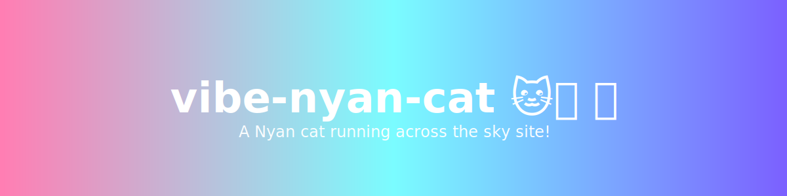

# Nyan Cat site

A Nyan cat running across the sky site!

Repository language composition
- JavaScript: 46.7%
- CSS: 43.6%
- HTML: 9.7%

Quick links
- Live site: Open index.html in a browser
- License: See LICENSE

Features
- A lightweight, browser-based Nyan Cat animation.
- No build step required — just open index.html.
- Minimal, CSS-driven visuals with JavaScript for behavior.

How to run locally
1. Clone the repo:
   git clone https://github.com/T0liver/vibe-nyan-cat.git
2. Open the project folder and open index.html in your browser:
   - double-click index.html, or
   - use a simple static server (recommended for local testing):
     - Python 3.x: python -m http.server 8000
     - then open http://localhost:8000

How it’s organized
- index.html
- styles.css
- script.js
- src/
- assets/

Contributing
- Suggestions, bug reports, and PRs welcome.
- If adding images/screenshots, put them in assets/ and reference from the README.
- Keep changes focused and small; include a brief description in your PR.

License
- This project includes a MIT licence. See under the [LICENCE](./LICENCE)
 
